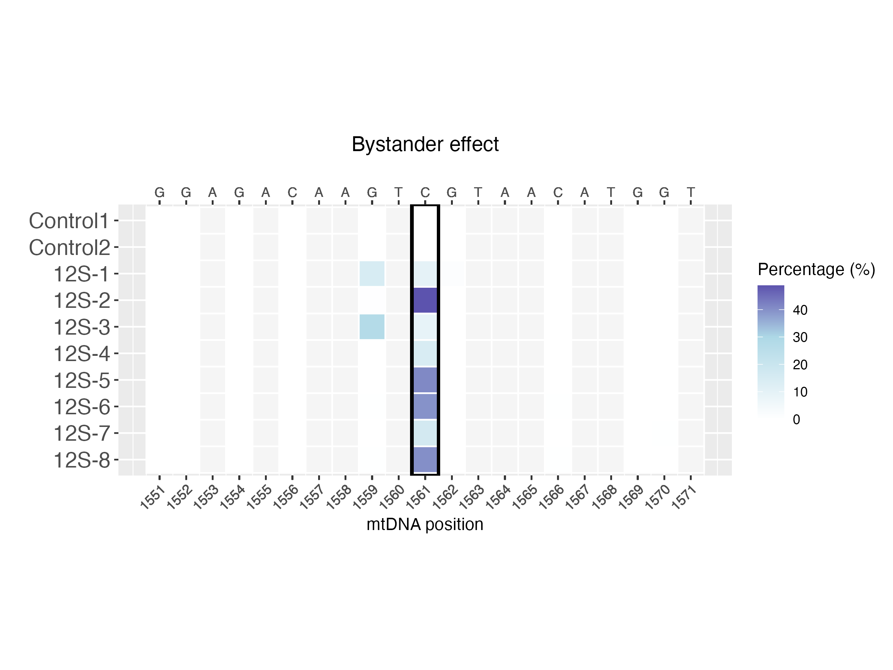
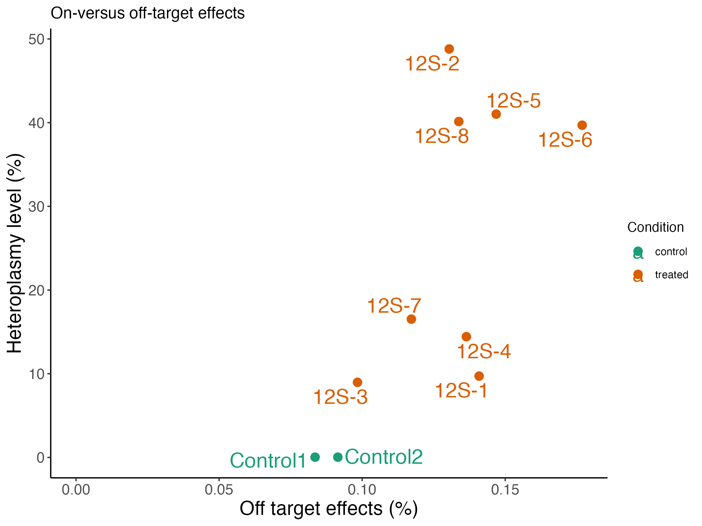

# MitoBEAP

MitoBEAP is an R package for the analysis of mitochondrial base editing outcomes from next-generation sequencing data. It enables quantification of on-target editing efficiency, identification of bystander and off-target edits, and generation of publication-ready visualisations and reports.

<p align="center">
  
  
</p>

---

## Features

- Quantifies on-target mitochondrial base editing efficiency  
- Identifies and visualises bystander editing effects  
- Detects and characterises off-target editing events  
- Generates publication-ready plots and summary outputs  
- Supports reproducible analysis workflows for mitochondrial editing experiments  

---

# Installation

MitoBEAP can be installed directly from GitHub.

## Option 1 : 
Install 'remotes' package if needed:
```r
install.packages("remotes")
remotes::install_github("NextGenSeek/MitoBEAP")
```

## Option 2 : 
Install 'devtools' if needed:
```r
install.packages("devtools")
devtools::install_github("NextGenSeek/MitoBEAP")
```

## Dependencies:
All package dependencies are listed in the DESCRIPTION file and are installed automatically during installation.

---

# Quick start
Load the package:
```r
library(MitoBEAP)
```
To see an example, check [docs/quickstart.md](/docs/quickstart.md) or to see a detailed example:
```r
vignette("MitoBEAP")
```

## Documentation
Information can be found in [docs](/docs). 
Detailed usage instructions and example workflows are provided in the package vignette.

## Example files
The ExampleFiles folder contains example datasets used in the manuscript:
Development of the Mitochondrial Base Editor Analysis Package (MitoBEAP) by Mutti et al.
These files can be used to reproduce the analyses and figures shown in the vignette.

---

# Citations
If you use MitoBEAP in your work, please cite:
Mutti et al. Development of the Mitochondrial Base Editor Analysis Package (MitoBEAP).

---

# License
This package is released under the MIT License. See `LICENSE.md` for details.
