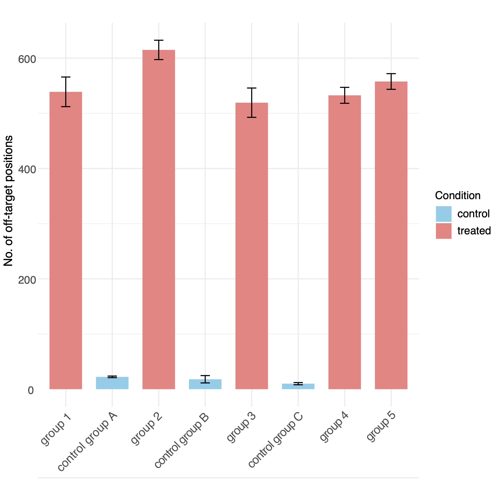

```{r setup, include=FALSE}
knitr::opts_chunk$set(echo = TRUE)
knitr::opts_chunk$set(warning = FALSE, message = FALSE) 
```

## Introduction

MitoBEAP is an R package designed to analyze mitochondrial base editing data from gene editing experiments, both mitochondrial cytosine base editors (mitoCBE) such as DdCBE and adenine base editors (mitoABE) such as TALED. It calculates both on-target and off-target editing efficiencies, visualizes editing patterns, and produces reports for submission to data repositories.

The package is optimized for input from VarScan2 output in .csv format, and includes functionality for depth filtering, control heteroplasmy adjustment, heatmaps, and summary statistics.

For more detail, see our associated publication: "Development of the Mitochondrial Base Editor Analysis Package (MitoBEAP)." Publication details will be added following publication.

## Input samples

This package is optimized to be used in combination with the output of VarScan2 (samtools mpileup -ABQ0 -aa --no-output-ins --no-output-ins --no-output-del --no-output-del --max-depth 0 --fasta-ref /path/to/ref.fasta | java -jar VarScan.jar readcounts --min-coverage 0) in .csv format. Two example datasets are provided in the ExampleFiles directory: 12S, containing the 12S rRNA base-editing dataset, and METTL15, containing the METTL15-related dataset used in the accompanying study. Each directory also contains the corresponding sample sheet required for the MitoBEAP workflow. The example datasets are available from the MitoBEAP GitHub repository: https://github.com/NextGenSeek/MitoBEAP/tree/main/ExampleFiles. Users can also analyse their own VarScan2 output or appropriately formatted pre-processed variant files, as described below.

Before starting, ensure you are working in the correct directory: (setwd("/path/to/working/directory") ). 

Then load the necessary libraries:

```{r}
library(readr)
library(tools)
library(splitstackshape)
library(tibble)
library(ggplot2)
library(dplyr)
library(tidyr)
library(ggrepel)
library(RColorBrewer)
library(MitoBEAP); packageVersion("MitoBEAP")
```

For this tutorial, we're using files included with the package. If you want to use your own files, you can upload your own files. 

If the coverage of a region is too low, a potential single read error will result in high "off-target percentages". Therefore, MitoBEAP requires the user to define the minimum depth or coverage you want to include. We would recommend not to include positions below a depth of 100. Depending on your experiment or amplicon choice, you might also be interested in a certain region only.

To begin, list your raw VarScan2 output files and define a minimum depth threshold for filtering. Skip this step if you have a different type of input files:

```{r echo=F}
###### NOT VISIBLE, BUT SCRIPT WILL RUN

example_dir <- system.file(
  "extdata",
  "12S",
  package = "MitoBEAP"
)

RawCountFiles <- list.files(
  example_dir,
  pattern = "\\.csv$",
  full.names = TRUE
)

RawCountFiles <- RawCountFiles[
  !grepl("Samplesheet", basename(RawCountFiles), ignore.case = TRUE)
]

# Filter positions by sequencing depth
invisible(lapply(
  RawCountFiles,
  LoadRawCount,
  depth = 100
))
```

```{r eval=FALSE}
# List input files
RawCountFiles <- list.files("./raw", 
                            pattern = "*.csv",
                            full.names = TRUE)

# Filter positions below the selected minimum sequencing depth
lapply(
  RawCountFiles,
  LoadRawCount,
  depth = 100
)

# To select a certain region use: this can be done with the function RegionSelection:

RegionSelection(RawCountFiles) # Default range: from start to end
RegionSelection(RawCountFiles, position_range = c(1000, 5000), depth_filter = TRUE, min_depth = 100)

```

To use all MitoBEAP functions, a sample sheet is required to link input files to sample metadata. At minimum, this should contain FileName (the input filename without the .csv extension), SampleName (the label used for the sample), and Condition (for example, control or treated). Additional columns, such as Order and CombinedName, are used by some plotting and grouping functions. Example sample sheets are provided with the 12S and METTL15 example datasets.

```{r, eval=FALSE}
SampleList <- read.csv("Samplesheet_12S.csv")
head(SampleList)
```

```{r echo=FALSE, results='markup'}
# NOT VISIBLE
SampleList <- read.csv(
  system.file(
    "extdata",
    "12S",
    "Samplesheet_12S.csv",
    package = "MitoBEAP"
  )
)
```

## Run Base Editing Analysis

Next, we'll perform the basic calculations. For this step, there are two variants, depending on the input files (VarScan2 as in the example) or alternative input files. As this tool is specifically designed to analyse cytosine base editors (CBE) or adenine base editors (ABE), it will only take C-T and G-A (CBE) or A-T to G-C (ABE) conversions into account and will ignore other changes, as those are existing variants or technical errors. In this step, you also have to assign the on-target position for your analysis. This matches the position of the reference genome you used to create the original input files.

Note: MitoBEAP's editor-specific off-target analyses focus on the expected substitution classes for the selected editor. Other mismatch types are not currently included in these editor-specific off-target summaries. MitoBEAP also does not currently assess indels or nuclear off-target editing; these require separate analyses.

The function below can be used if you use VarScan2 input files, like in our example. Otherwise, use the subsequent code (FilterCGEdits/FilterATEdits).

```{r eval=FALSE}
# List files. If you didn't change anything, you can just use the line below:
MinXFiles <- list.files("./minimum",full.names = TRUE)

# Specify the on-target position
OntargetPosition <- 1561

# Run analysis for CBE
lapply(
  MinXFiles,
  OnTargetCalcCBE,
  OntargetPosition = OntargetPosition
)

# Alternatively, run analysis for ABE
lapply(
  MinXFiles,
  OnTargetCalcABE,
  OntargetPosition = OntargetPosition
)
```

```{r echo=FALSE, results='hide'}
# NOT VISIBLE

# List depth-filtered files generated by LoadRawCount()
MinXFiles <- list.files(
  "./minimum",
  pattern = "\\.csv$",
  full.names = TRUE
)

# Specify the on-target position
OntargetPosition <- 1561

# Calculate on-target editing
invisible(lapply(
  MinXFiles,
  OnTargetCalcCBE,
  OntargetPosition = OntargetPosition
))
```

The following chunk should not be run when using the VarScan2 workflow above. It is intended for users starting from pre-processed variant files instead. These input files should be in CSV format and contain the following columns: chrom, position, ref_base, depth, base (alternative base), reads, and percentage.

```{r eval=FALSE}
# Select input files
allFiles <- list.files("./folder", pattern = "\\.csv$", full.names = TRUE)

# Run calculator: 
FilterCGEdits(allFiles) #CBE
# or
FilterATEdits(allFiles) #ABE
```

From here onwards, all steps should be the same, regardless of the input files.

## Summary Table Generation

Use the following functions to generate summaries of coverage, on-target editing, and mean off-target editing, and combine these with the sample information into a single overview table:

```{r eval=FALSE}
# Calculate average coverage
CoverageFiles <- list.files("./Coverage",
                            pattern = "*.txt",
                            full.names = TRUE)
Coverage <- as.data.frame(CoverageCalc(CoverageFiles))

# Calculate mean off-target editing
MeanFiles <- list.files("./mean",
                        pattern = "*mean.txt",
                        full.names = TRUE)
Mean <- as.data.frame(MeanCalc(MeanFiles))

# Combine on-target editing results
OnTargetFiles <- list.files("./OnTarget",
                            pattern = "*ontarget.txt",
                            full.names = TRUE)
OnTarget <- as.data.frame(CombineOnTarget(OnTargetFiles))

# Create the combined overview table
Overview <- CreateOverview(
  All_mean = Mean,
  OnTarget = OnTarget,
  Coverage = Coverage,
  SampleList = SampleList
)
```

```{r echo=FALSE, results='hide'}
# Generate summary objects used by subsequent vignette sections

CoverageFiles <- list.files(
  "./Coverage",
  pattern = "*.txt",
  full.names = TRUE
)
Coverage <- as.data.frame(CoverageCalc(CoverageFiles))

MeanFiles <- list.files(
  "./mean",
  pattern = "*mean.txt",
  full.names = TRUE
)
Mean <- as.data.frame(MeanCalc(MeanFiles))

OnTargetFiles <- list.files(
  "./OnTarget",
  pattern = "*ontarget.txt",
  full.names = TRUE
)
OnTarget <- as.data.frame(CombineOnTarget(OnTargetFiles))

Overview <- CreateOverview(
  All_mean = Mean,
  OnTarget = OnTarget,
  Coverage = Coverage,
  SampleList = SampleList
)
```
This creates `All_Ontarget_mean_Coverage.csv` in the `Overview` directory and returns the combined overview table.

By default, `CreateOverview()` retains the intermediate output directories (`minimum`, `Coverage`, `mean`, `OnTarget`, and `percentages`). If these intermediate files are no longer required, they can be removed automatically after the overview is generated by setting `cleanup = TRUE`.

### Coverage differences between samples

`CreateOverview()` checks for large differences in average sequencing coverage between samples. By default, a warning is issued when the highest-coverage sample has more than 10-fold the coverage of the lowest-coverage sample. Large differences in sequencing depth may affect comparisons of low-frequency editing events. The warning does not alter or stop the analysis.

The warning threshold can be changed, for example:

```{r eval=FALSE}
Overview <- CreateOverview(
  All_mean = Mean,
  OnTarget = OnTarget,
  Coverage = Coverage,
  SampleList = SampleList,
  coverage_ratio_warning = 5
)
```

Set `coverage_ratio_warning = NULL` to disable this check.

### Output location

By default, MitoBEAP writes output to subdirectories of the current working directory. The `out_dir_base` argument can be used to specify a different base directory without changing the R working directory. For example:

```{r eval=FALSE}
Overview <- CreateOverview(
  All_mean = Mean,
  OnTarget = OnTarget,
  Coverage = Coverage,
  SampleList = SampleList,
  out_dir_base = "/path/to/analysis"
)
```

In this example, the overview table is written to `/path/to/analysis/Overview/All_Ontarget_mean_Coverage.csv`.

## Export Excel Workbook

MitoBEAP also has the option to generate an excel spreadsheet with all data, which could be used as overview table when uploading the raw fastq files to a data repository. A spreadsheet can be easily created by the following command:

```{r echo=FALSE}
CreateSpreadsheet()
```

```{r eval=FALSE}
CreateSpreadsheet()
```

After running this command, the spreadsheet should now be available in the folder Overview

## Depth and Heteroplasmy Overview

DepthFile() generates a CSV file containing the sequencing depth and heteroplasmy percentage for each position in each sample. By default, the entire analysed sequence is included, but users can restrict the output to a specific region using fromP and toP. The resulting table can be used for additional visualization or downstream analysis in R, Excel, GraphPad Prism, or other software.

```{r echo=FALSE}
DepthFile(fromP = 1, toP = 500) # default is from start to end
```

```{r eval=FALSE}
# Generate depth and heteroplasmy information for the entire sequence
DepthFile()

# Alternatively, restrict the output to a specific region
DepthFile(fromP = 1, toP = 500)
```

## Complete mismatch spectrum

In addition to editor-specific analysis, MitoBEAP can examine the complete single-nucleotide mismatch spectrum before applying chemistry-specific filtering. This can be useful for assessing whether editing is restricted to the expected nucleotide conversions or whether other substitution types are also present.

`CalculateMismatchSpectrum()` retains every non-reference nucleotide reported at each position and calculates its percentage of the total sequencing coverage. The output therefore includes all 12 possible single-nucleotide substitution classes (A>C, A>G, A>T, C>A, C>G, C>T, G>A, G>C, G>T, T>A, T>C, and T>G).

```{r eval=FALSE}
MismatchSpectrum <- CalculateMismatchSpectrum(
  out_dir_base = "."
)
```

Alternatively, input files can be supplied explicitly:

```{r eval=FALSE}
MismatchSpectrum <- CalculateMismatchSpectrum(
  AllReportFiles = AllReportFiles,
  out_dir_base = "."
)
```

The complete mismatch tables are written to the `MismatchSpectrum` directory and are also returned as a combined data frame with the following columns: `FileName`, `position`, `RefBase`, `MutBase`, `MutReads`, `Coverage`, `percentage`, and `Mutation`.

This analysis is chemistry-independent. Editor-specific filtering can subsequently be performed using the appropriate MitoBEAP workflow, such as C-to-T/G-to-A substitutions for DdCBE or A-to-G/T-to-C substitutions for adenine base editors.

### Most abundant mismatch per position

For users interested only in the predominant non-reference nucleotide at each position, `CalcAllMutations()` provides a simplified summary:

```{r eval=FALSE}
CalcAllMutations(
  out_dir_base = "."
)
```

Unlike `CalculateMismatchSpectrum()`, `CalcAllMutations()` retains only the most abundant non-reference base at each position. This output is used by `DdCBE_df_All()` for the existing highest-mismatch analysis workflow.

`CalculateMismatchSpectrum()` and `CalcAllMutations()` analyse single-nucleotide mismatches only. They do not detect or quantify insertions or deletions, and MitoBEAP does not currently assess nuclear off-target sites.

## Visualization options

MitoBEAP provides several options for visualizing editing outcomes. One of the simplest figures is a barchart to show the on-target base editing for each sample:

```{r eval=FALSE}
CreateBarChart(
  data_type = "OnTarget",
  colour = "lightgreen",
  All_ontarget = OnTarget,
  SampleList = SampleList
)
```

```{r echo=FALSE, results='hide', fig.show='hide'}
CreateBarChart(
  data_type = "OnTarget",
  colour = "lightgreen",
  All_ontarget = OnTarget,
  SampleList = SampleList
)
```

```{r, echo=FALSE, out.width= '70%'}
knitr::include_graphics("Plots/Barchart_OnTarget.png")
```

Or a barchart showing the mean off-target levels

```{r eval=FALSE}
CreateBarChart(
  data_type = "OffTarget",
  colour = "skyblue",
  All_mean = Mean,
  SampleList = SampleList
)
```

```{r echo=FALSE, results='hide', fig.show='hide'}
CreateBarChart(
  data_type = "OffTarget",
  colour = "skyblue",
  All_mean = Mean,
  SampleList = SampleList
)
```

```{r, echo=FALSE, out.width='70%'}
knitr::include_graphics("Plots/Barchart_OffTarget.png")
```

## Scatterplots of Off-target Editing

To visualize off-target effects for each sample individually, scatter plots are very helpful. Again, these can easily be generated. The user can specify to label the dots above a certain level by position.

```{r echo=FALSE}
Adj <- DdCBE_df(SampleList = SampleList)

AdjScatter(
  labelPercentage = 10,
  Adj = Adj,
  OntargetPosition = OntargetPosition
)

file.copy(
  "Plots/AdjustedPlots/12S-2.png",
  "Plots/AdjustedPlots/12S-2_unadjusted.png",
  overwrite = TRUE
)
```

```{r eval=FALSE}
Adj <- DdCBE_df(SampleList = SampleList)

AdjScatter(
  labelPercentage = 10,
  Adj = Adj,
  OntargetPosition = OntargetPosition
)
```

```{r, echo=FALSE, out.width= '80%'}
knitr::include_graphics("Plots/AdjustedPlots/12S-2_unadjusted.png")
```

## Remove Control Backgrounds (heteroplasmy)

For most experiments, the cells or tissues analysed will not match the reference genome at every position. Positions with high heteroplasmy in control samples may represent pre-existing variants rather than editing events. MitoBEAP therefore allows these positions to be excluded from adjusted off-target calculations. max_threshold specifies the heteroplasmy percentage used to identify these positions, while controls specifies the minimum number of control samples in which the threshold must be reached. For example, max_threshold = 90 and controls = 3 masks a position if it has at least 90% heteroplasmy in at least three control samples. If no control-background masking is desired, max_threshold = 100 can be used.

When DdCBE_df() is run, MitoBEAP reports the number of positions masked using these criteria and, when applicable, their genomic coordinates. This makes the control-derived filtering explicit and allows users to record which positions were excluded from the adjusted analysis.

The user can also further optimize the figure, by removing dots below a certain value from the figure (however, it should be noted that those positions will be taken into account for off-target calculations)

To exclude polymorphic positions present in controls:
```{r echo=FALSE}
Adj <- DdCBE_df(
  max_threshold = 90,
  controls = 3,
  SampleList = SampleList
)

AdjScatter(
  min_threshold = 1.2,
  labelPercentage = 10,
  Adj = Adj,
  OntargetPosition = OntargetPosition
) # labelPercentage = default = 10

file.copy(
  "Plots/AdjustedPlots/12S-2.png",
  "Plots/AdjustedPlots/12S-2_90.png",
  overwrite = TRUE
)
```

```{r eval=FALSE}
Adj <- DdCBE_df(
  max_threshold = 90,
  controls = 3,
  SampleList = SampleList
)

AdjScatter(
  min_threshold = 1.2,
  labelPercentage = 10,
  Adj = Adj,
  OntargetPosition = OntargetPosition
) # labelPercentage = default = 10
```

```{r, echo=FALSE, out.width= '80%'}
knitr::include_graphics("Plots/AdjustedPlots/12S-2_90.png")
```

The user might also want to recalculate off-target averages and create a barchart with the above specified maximum heteroplasmy levels in controls. 

```{r echo=FALSE}
# Recalculate off-target barchart with this max_threshold
AdjCreateBarChart(
  colour = "skyblue",
  Adj = Adj,
  SampleList = SampleList
)
```

```{r eval=FALSE}
# Recalculate off-target average with this max_threshold
AdjOffTargetResults <- AdjOffTarget(
  Adj = Adj,
  SampleList = SampleList,
  OnTarget = OnTarget,
  Coverage = Coverage
)
# Create barchart with this max_threshold
AdjCreateBarChart(
  colour = "skyblue",
  Adj = Adj,
  SampleList = SampleList
)
```

```{r, echo=FALSE, out.width='70%'}
knitr::include_graphics(
  "Plots/AdjustedPlots/Adjusted_Barchart_offTarget.png")
```

## Comparative Plot: On- vs Off-target

This plot shows on-target versus adjusted off-target editing:

```{r eval=FALSE}
OnVsOffTargetAdj(
  Adj = Adj,
  All_ontarget = OnTarget,
  SampleList = SampleList
) #standard = Condition = TRUE, FALSE= no condition information
# default xlab = "Off-target editing (%)"
# default ylab = "On target editing (%)"
# default ggtitle = "On-versus off-target effects"
```

```{r echo=FALSE, results='hide', fig.show='hide'}
OnVsOffTargetAdj(
  Adj = Adj,
  All_ontarget = OnTarget,
  SampleList = SampleList
) #standard = Condition = TRUE, FALSE= no condition information
```

```{r echo=FALSE, out.width='70%'}
knitr::include_graphics(
  "Plots/AdjustedPlots/OnOffTarget_Adj.png")
```

## Statistical analysis of editing outcomes

In addition to visualizing editing frequencies, MitoBEAP can statistically compare editing between treated and control samples. Two complementary approaches are provided: an empirical control-derived background threshold and per-position comparison of editing read counts.

### Empirical control-derived detection limit

`CalculateLOD()` estimates an empirical detection threshold from the distribution of editing percentages observed in control samples. By default, the 99th percentile of the control background is used. Positions previously masked during control-background filtering are excluded, and the intended on-target position can also be excluded.

This threshold represents an empirical control-derived background threshold and should not be interpreted as an instrument-specific analytical limit of detection established by a dilution series.

```{r eval=FALSE}
LOD_results <- CalculateLOD(
  Adj = Adj,
  control = "control",
  percentile = 0.99,
  OntargetPosition = OntargetPosition
)

LOD_results$LOD
```

The returned object also contains the percentile used, the number of control observations and control samples contributing to the calculation, and the background values used to derive the threshold.

### Per-position treated versus control comparison

`CompareEditing()` compares treated and control editing at each mitochondrial position using pooled edited and non-edited read counts. Fisher's exact test is performed for each position and p-values are adjusted for multiple testing using the Benjamini-Hochberg false discovery rate (FDR) procedure. The function also reports 95% Wilson confidence intervals for editing percentages.

```{r eval=FALSE}
EditingStats <- CompareEditing(
  Adj = Adj,
  treated = "treated",
  control = "control"
)

head(EditingStats)
```

The output includes treated and control read depth, edited-read counts, editing percentages, 95% confidence intervals, the difference in editing percentage, odds ratio, raw p-value, and FDR-adjusted p-value.

The Fisher's exact test operates on pooled sequencing reads at each position. It therefore assesses evidence for a difference in editing read proportions but does not model biological replicate-to-replicate variability. Biological samples should not be treated as independent sequencing reads when evaluating experiment-level effects. Sample-level off-target burden can instead be compared across biological samples as described below.

## Comparative Plot: grouped results

## Sample-level off-target burden

For datasets containing biological replicates, `off_target_count_summary()` can be used to quantify off-target burden at the sample level. The function counts the number of off-target positions within a specified editing range for each sample and summarizes these counts across experimental groups.

The empirical control-derived threshold calculated by `CalculateLOD()` can be supplied as `lower`, so that only positions with editing above the observed control background are counted. The intended on-target position can be excluded using `OntargetPosition`.

When both control and treated conditions contain at least two samples, the function also performs a two-sided Wilcoxon rank-sum test comparing the per-sample off-target burden between conditions. In contrast to the per-position Fisher's exact test above, the biological sample is therefore the unit of analysis for this comparison.

For grouped plotting, `SampleList` must contain a `CombinedName` column specifying which samples belong to the same replicate group.

```{r eval=FALSE}
off_target_results <- off_target_count_summary(
  Adj = Adj,
  SampleList = SampleList,
  lower = LOD_results$LOD,
  upper = 70,
  OntargetPosition = OntargetPosition
)

# Per-sample number of off-target positions above the empirical threshold
off_target_results$counts

# Group summary
off_target_results$stats

# Sample-level treated versus control comparison
off_target_results$burden_test
```
An example output from a separate dataset is shown below to illustrate the grouped summary plot.
```{r, echo=FALSE, out.width='60%'}

```

## Heatmap of Bystander Editing

Base editing can be very specific, but unintended bystander edits may occur within the activity window of the editor. Visualizing editing frequencies surrounding the target site can therefore help identify potential bystander mutations.

Visualize editing levels near the on-target position:

```{r eval=FALSE}
Bystander(
  BystanderDistance = 10,
  title = "Bystander effect",
  xlab = "mtDNA position",
  Adj = Adj,
  SampleList = SampleList,
  OntargetPosition = OntargetPosition
)
```

```{r echo=FALSE}
Bystander(
  BystanderDistance = 10,
  xlab = "mtDNA position",
  Adj = Adj,
  SampleList = SampleList,
  OntargetPosition = OntargetPosition
)
```

This creates the desired heatmap in the folder Plots. By default, the heatmap uses a customizable colour scale in which 0% editing is displayed as white, 30% as light blue, and 100% as dark blue. Users can modify both the colours and the corresponding percentage values:

```{r}
# Bystander(
#   BystanderDistance = 10,
#   fill_colours = c("white", "yellow", "red"),
#   fill_values = c(0, 10, 100),
#   Adj = Adj,
#   SampleList = SampleList,
#   OntargetPosition = OntargetPosition
# )
```

```{r, echo=FALSE, out.width='70%'}
knitr::include_graphics("Plots/HeatmapBystanderEffect.png")
```

Alternatively, to create this heatmap with only the potential target sites (CG for CBE or AT for ABE) use the following function

```{r eval=FALSE}
bystander_only_relevant(
  BystanderDistance = 10,
  title = "Bystander effect",
  xlab = "mtDNA position",
  Adj = Adj,
  SampleList = SampleList,
  OntargetPosition = OntargetPosition
)
```

```{r echo=FALSE, results='hide'}
bystander_only_relevant(
  BystanderDistance = 10,
  title = "Bystander effect",
  xlab = "mtDNA position",
  Adj = Adj,
  SampleList = SampleList,
  OntargetPosition = OntargetPosition
)
```

```{r, echo=FALSE, out.width='60%'}
knitr::include_graphics("Plots/HeatmapBystanderEffect_only_relevant.png")
```


## Histogram of off-target effect


```{r eval=FALSE}
plot_OffTarget_histograms(
  bw = 0.1,
  min_pct = 0.1,
  max_pct = 5,
  Adj = Adj,
  OntargetPosition = OntargetPosition
)
# default binwidth bw = 1
# default min_pct = 0
# default max_pct = Inf
```

```{r echo=FALSE, out.width='60%'}
plot_OffTarget_histograms(
  bw = 0.1,
  min_pct = 0.1,
  max_pct = 5,
  Adj = Adj,
  OntargetPosition = OntargetPosition
)
```

```{r, echo=FALSE, out.width='70%'}
knitr::include_graphics("Plots/Histogram_12S_1.png")
```

## Conclusion

MitoBEAP offers a fast and reproducible way to analyze mitochondrial base editing datasets, with robust filtering and visualization options. It is adaptable to various types of experiments and ready for integration with data repositories.

For questions or contributions, please visit our GitHub page. <https://github.com/NextGenSeek/MitoBEAP>
